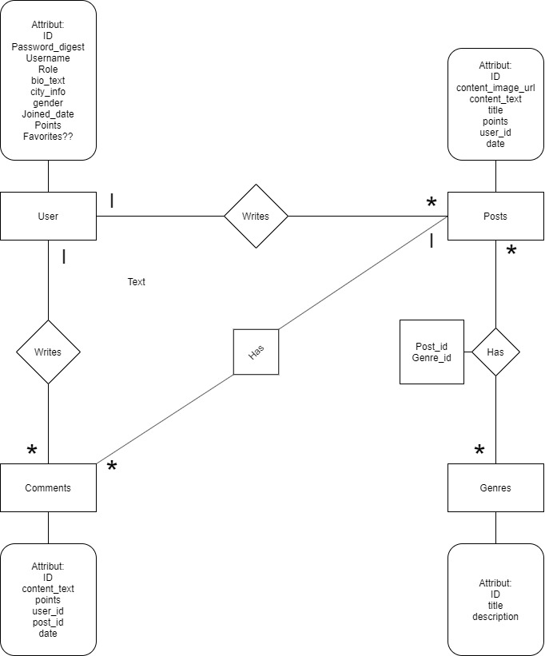

# Projektplan

## 1. Projektbeskrivning (Beskriv vad sidan ska kunna göra)

Jag ska kopiera imgur mer eller mindre. Annan css men funktionerna ska vara ungefär samma.
På sidan kan man lägga upp bilder med en titel och innehåll. På inläggen går det att kommentera
samt ge up- och downvotes. På ens profil kan man skriva en bio, staden man bor i och ha en profilbild.

## 2. Vyer (visa bildskisser på dina sidor)

Finns inga skisser

## 3. Databas med ER-diagram (Bild)

## 4. Arkitektur (Beskriv filer och mappar - vad gör/inehåller de?)

I Public mappen ligger bilderna till hemsidan, css, och Js filerna. I views ligger mina olika vyer
och i root filen ligger min kod. I en map som heter database ligger databas filen.
I root mappen ligger tre olika ruby-filer.
Den första app.rb är min Controller och är kod som tar hand om olika routes och vad som händer med
websidan när de åkallas. Min model fil är uppdelad i två filer, db_function.rb och functions.rb.
Skilnaded mellan dessa är att i functions ligger funktioner som bara använder ren Ruby kod
och i db_function ligger funktioner som hanterar databasen.
